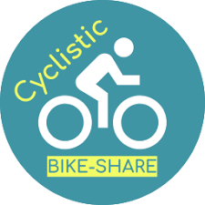

TL;DR

## CYCLISTIC BIKE_SHARE

### Business Question
How does a bike-share navigate speedy success? 

Cyclistic is a bike-sharing project in Chicago with 5,824 bicycles located at 692 stations. The company has two distinct groups - casual riders and dedicated members. 

### Ask
The goal is to create targeted marketing methods that can smoothly convert casual riders into devoted annual members. 
### Objective
This analysis aims to uncover actionable insights to drive the conversion of casual riders into Cyclistic annual members. 
### Prepare & Process
The methodology includes data collection, preparation, segmentation, and usage patterns analysis. 
### Act & Share
The insights gained will be used to create targeted marketing initiatives and incentives to encourage casual riders to upgrade to annual memberships.
### Other Resources
* <a href="https://docs.google.com/document/d/1n2W-mk2_vhn_ci0I086St27Fl0-lYQ-l_pgh7ukG9eM/edit?usp=sharing" target=”_blank” rel="noopener noreferrer">Detailed Report</a>
* <a href="https://www.kaggle.com/code/bisolaogunye/cyclistic-bike-sharing-analysis" target=”_blank” rel="noopener noreferrer">Analysis</a>
* <a href="https://public.tableau.com/views/CyclisticDashboard2_16964892086230/MainDashboard?:language=en-US&:display_count=n&:origin=viz_share_link" target=”_blank” rel="noopener noreferrer">Data Visualization</a>
